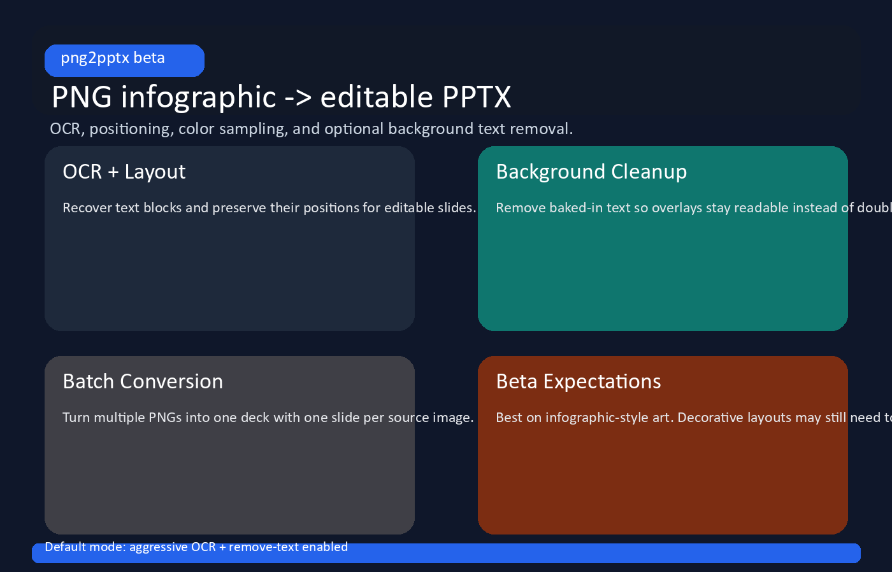
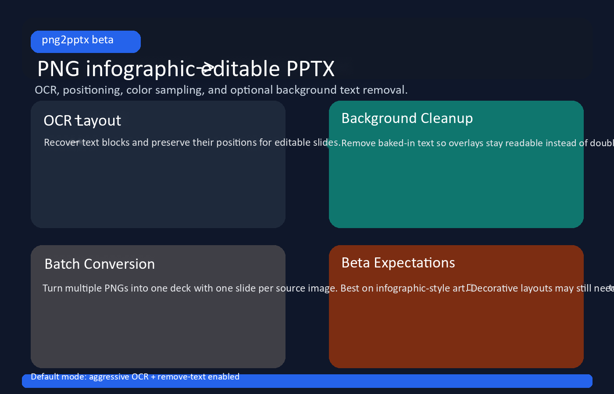

# png2pptx

Convert infographic-style PNGs into editable PowerPoint slides.

`png2pptx` keeps the source image as the slide background, OCRs text out of the PNG, and recreates that text as editable PowerPoint text boxes so you can update labels and copy without rebuilding the slide by hand.

> **Status:** v0.1 beta. The current release is aimed at infographic and diagram-style images with reasonably clear text. It works well on many layouts, but it is not a promise of perfect OCR or perfect visual matching on every design.

## What you get

- editable text overlays placed near their original positions
- sampled text colors taken from the source image
- optional background text removal via inpainting
- aggressive OCR enabled by default for better recall
- batch conversion: one input PNG per slide

## Repo-safe example

| Sample input | Generated output preview |
| --- | --- |
|  |  |

The sample assets are safe to publish and are included so the README shows what the tool is trying to produce before you run it yourself.

## Prerequisites

**Tesseract OCR** must be installed on your system.

- **Windows**: Download from [UB Mannheim](https://github.com/UB-Mannheim/tesseract/wiki) and add it to `PATH`
- **macOS**: `brew install tesseract`
- **Linux**: `sudo apt install tesseract-ocr`

If you are working in PowerShell on Windows and Tesseract is installed but not on `PATH`, this session-only fix is often enough:

```powershell
$env:path="C:\Program Files\Tesseract-OCR;$env:path"
```

## Installation

```bash
pip install -e .
```

OpenCV is installed as part of the package and is used for inpainting plus the higher-recall OCR path.

## Quickstart

Convert the bundled example:

```bash
png2pptx convert examples/sample_input.png -o sample_output.pptx
```

By default, `png2pptx` now:

- uses `--ocr-mode aggressive`
- uses `--remove-text`

If you want to keep the original source text in the background image, disable inpainting explicitly:

```bash
png2pptx convert examples/sample_input.png -o sample_output.pptx --no-remove-text
```

Batch convert multiple PNGs into one deck:

```bash
png2pptx convert slide1.png slide2.png slide3.png -o deck.pptx
```

## CLI options

| Flag | Default | Description |
| --- | --- | --- |
| `-o, --output` | `output.pptx` | Output PPTX path |
| `--confidence` | `40` | Minimum OCR confidence (0-100) |
| `--lang` | `eng` | Tesseract language code |
| `--ocr-mode` | `aggressive` | `aggressive` is the default higher-recall path; `fast` is quicker but may miss more text |
| `--remove-text / --no-remove-text` | `--remove-text` | Remove detected text from the background image before adding editable text |

## How it works

1. **OCR** - Tesseract extracts word boxes from the PNG.
2. **Layout grouping** - nearby words are grouped into text blocks.
3. **Color sampling** - likely text color is estimated from the source image.
4. **Background cleanup** - detected text can be inpainted out of the background image.
5. **PPTX generation** - the PNG becomes the slide background and editable text is layered on top.

## What to expect

`png2pptx` works best when the source image looks like a presentation graphic:

- headings, labels, and body text are visually distinct
- text is mostly horizontal
- background art is not too dense around the copy

Current weak spots:

- font family matching is still approximate
- decorative icons and stylized typography can still create OCR mistakes
- dense or low-contrast images may miss text or produce noisy fragments
- different visual styles can behave very differently even with aggressive OCR enabled

## Future considerations

The current beta intentionally keeps scope tight. Deferred work that should be picked back up after launch includes:

- missed-region recovery for text-like areas Tesseract skips entirely
- optional second OCR backend support if Tesseract tops out on harder layouts
- better font inference for closer visual matching
- richer diagnostics for tuning difficult images

## Development

Install development dependencies and run the test suite:

```bash
pip install -e ".[dev]"
pytest -q
```

Before opening a public-facing PR, make sure docs stay aligned with real CLI behavior and avoid committing local/generated artifacts such as virtualenvs, build outputs, or ad-hoc debug exports.
